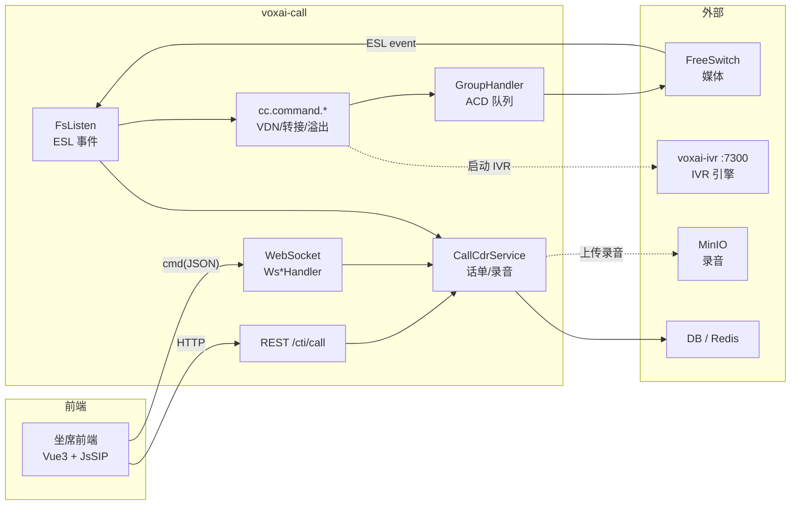
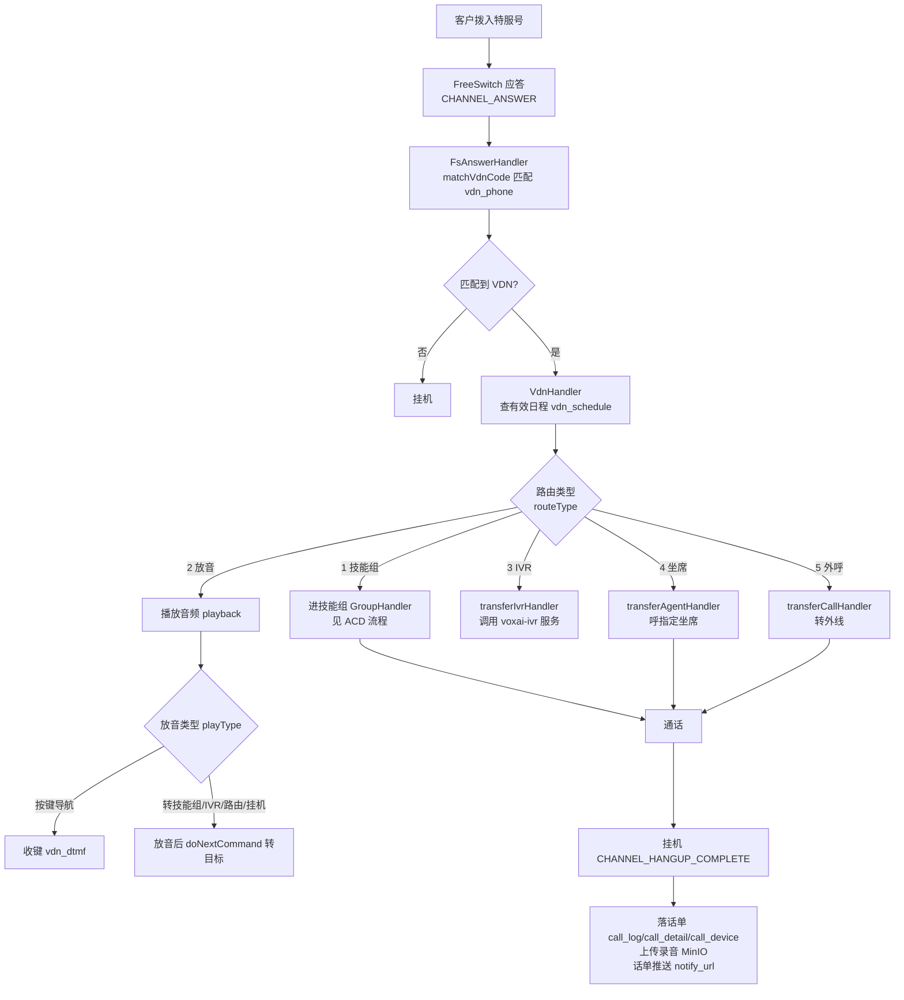
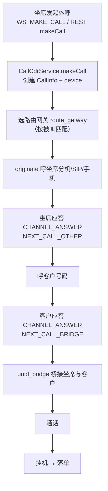
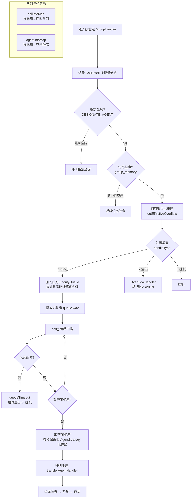
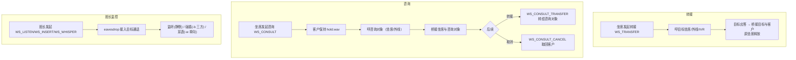
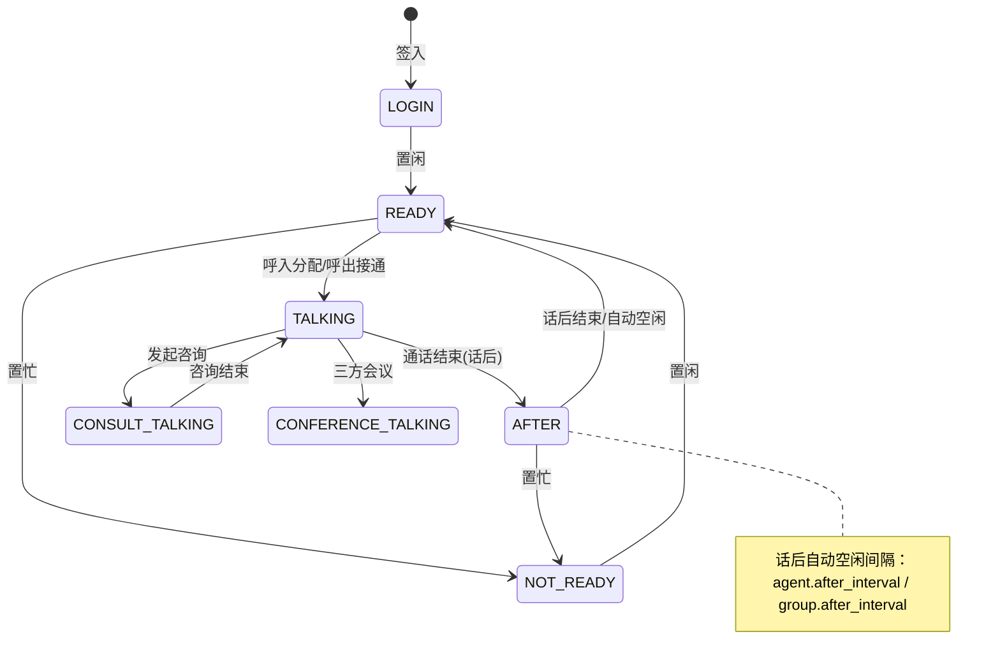
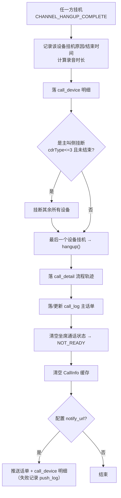
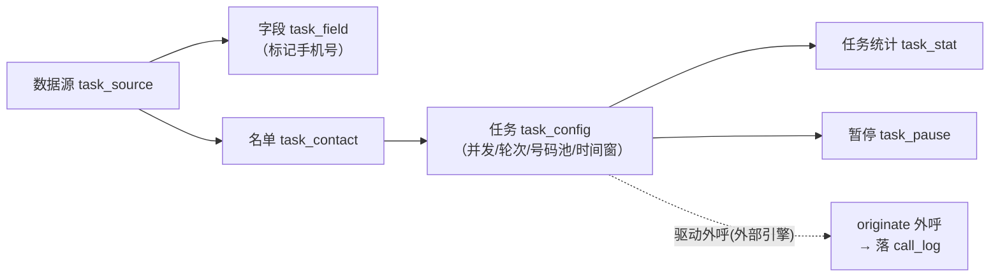

# 02 · 业务流程

> 流程图基于 `voxai-call` 模块实际代码梳理（`FsListen`、`Fs*Handler`、`cc.command.*`、`cc.acd.*`、
> `cc.websocket.handler.*`、`CallCdrService`）。图使用 Mermaid。

## 0. 总体架构与事件驱动模型

`FsListen` 连接 FreeSwitch（`cc_station` 中 `application_type=4` 的媒体服务），订阅全部 ESL 事件，
按事件名通过 `HandlerContext` 分发到 `@HandlerType` 标注的处理器。呼叫链路状态保存在 Redis（`CacheService`），
核心对象为 `CallInfo`（一次通话）与 `DeviceInfo`（通话中的一个「腿」/设备）。

## 1. 呼入流程（Inbound）

客户拨打企业特服号，FreeSwitch 应答后触发 `CHANNEL_ANSWER`，`FsAnswerHandler.matchVdnCode` 用被叫号码
匹配 `cc_vdn_phone` 得到 VDN，进入 `VdnHandler` 按有效日程路由。

## 2. 呼出流程（坐席外呼）

坐席通过 WebSocket 或 REST 发起外呼，`CallCdrService.makeCall` 创建 `CallInfo`，经媒体网关
`bgapi originate` 呼坐席，坐席应答后呼客户，客户应答后桥接。

## 3. ACD 排队与分配流程

电话进入技能组后的核心流程，含指定坐席、记忆坐席、溢出策略、排队与定时分配。

### 3.1 分配策略（`cc.acd.assign` / `AgentStrategy`）

| 策略实现 | 含义（对应 `strategy_value`） |
| --- | --- |
| `LongReadyAssign` | 1 最长空闲时间 |
| `TotalReadyAssign` / `TotalReadyTimesAssign` | 2 最长平均空闲 |
| `LeastAnswerAssign` | 3 最少应答次数 |
| `LeastTalkAssign` | 4 最少通话时长 |
| `TotalAfterTimeAssign` | 5 最长话后时长 |
| `PollAssign` | 6 轮选 |
| `RandomAssign` | 7 随机 |
| `AgentCustomAssign` | 自定义（`customExpression` SpEL / `cc_group_strategy_exp`） |

### 3.2 排队策略（`cc.acd.lineup` / `LineupStrategy`）

| 策略实现 | 含义（对应 `busy_type`） |
| --- | --- |
| `DefaultLineupStrategy` | 1 先进先出 |
| `VipLineupStrategy` | 2 VIP 优先 |
| `CustomLineupStrategy` | 3 自定义表达式 |

## 4. 转接 / 咨询 / 会议 / 班长监控

## 5. 坐席状态机

`AgentState` 枚举定义了坐席完整状态，`GroupHandler.agentFree/agentNotReady` 维护空闲坐席池。

## 6. 挂机与落单流程

## 7. 外呼任务流程（配置域）

任务域数据由 admin 管理；拨号引擎为外部组件。这里给出数据侧关系：

## 8. 坐席状态订阅（TCP，供第三方系统）

`TcpServer` 提供坐席状态订阅，`Sub*Handler` 处理订阅事件，用于第三方系统（CRM 等）实时获取坐席状态与通话事件。

| 订阅事件 | 说明 |
| --- | --- |
| `SubLogin` | 登录订阅 |
| `SubMakeCall` / `SubAnswer` | 呼叫/应答事件 |
| `SubStartCall` / `SubStopCall` | 通话开始/结束 |
| `SubPlayFile` / `SubQueuePlay` / `SubQueuePlayStop` | 放音事件 |
| `SubTransferTo` | 转接事件 |
