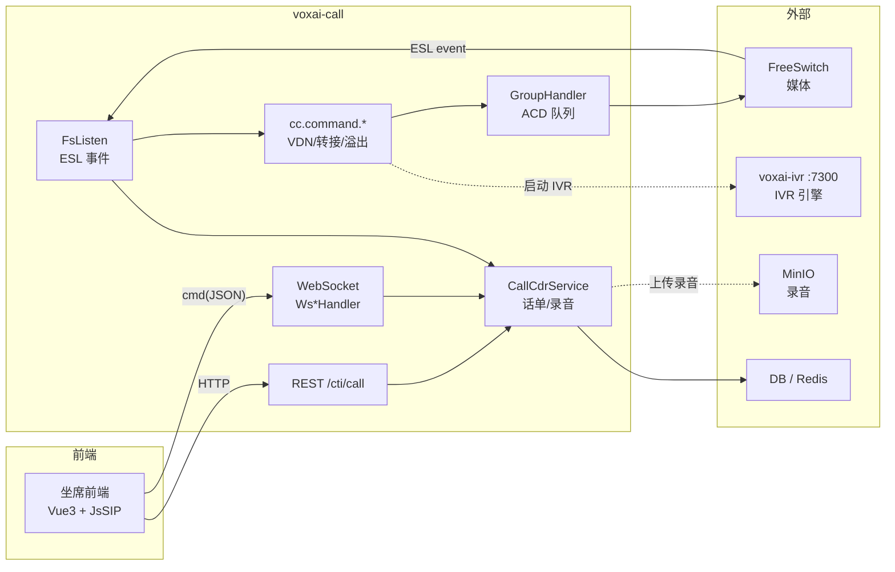
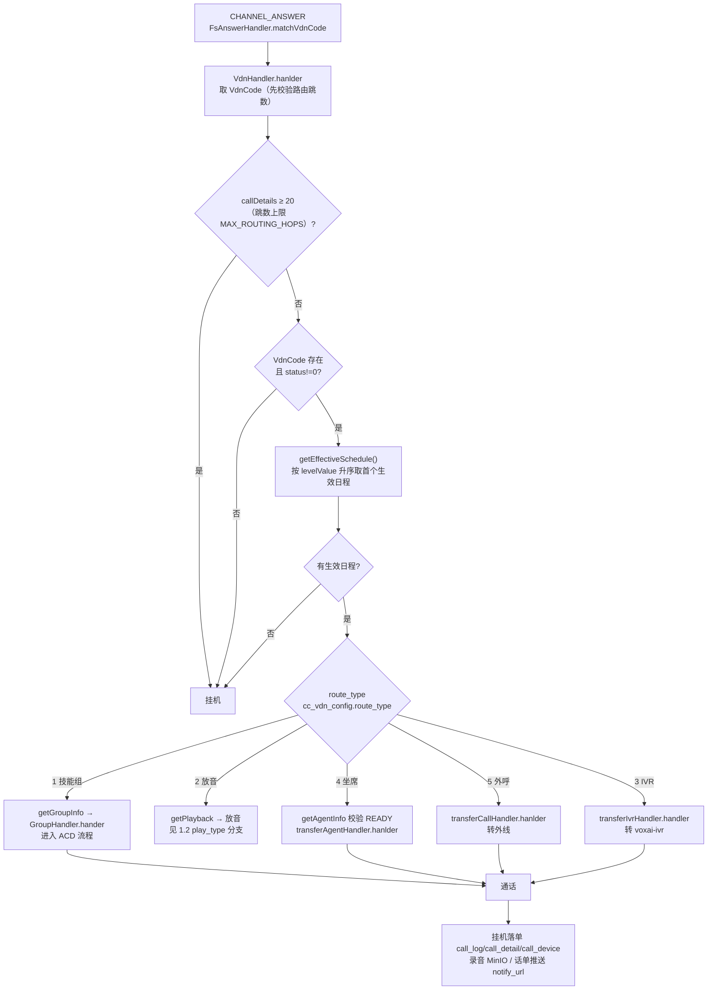
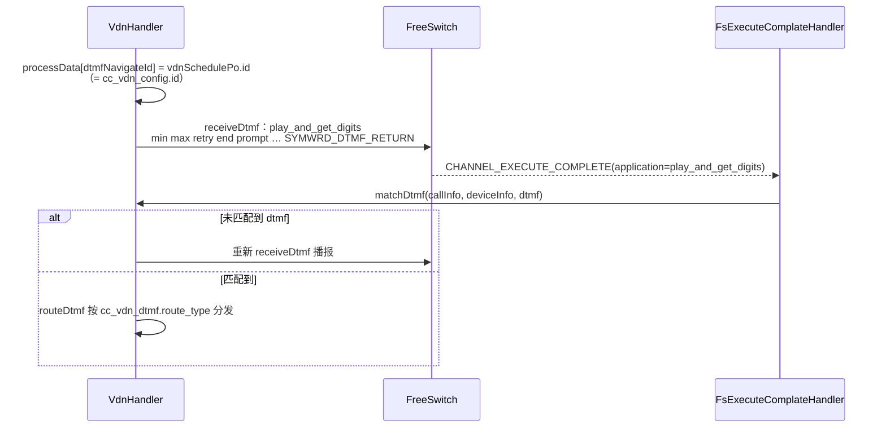
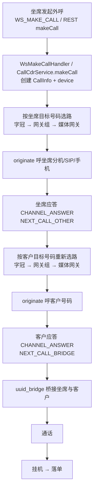
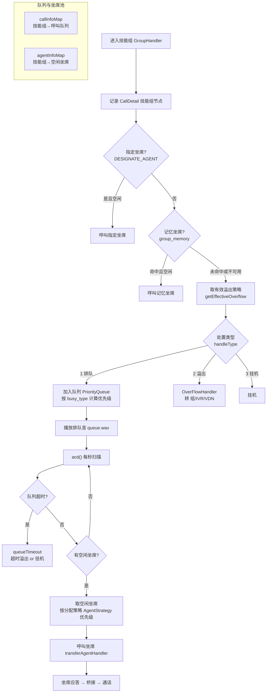
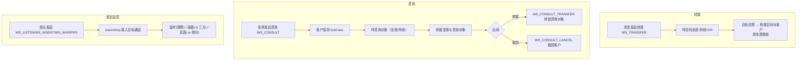
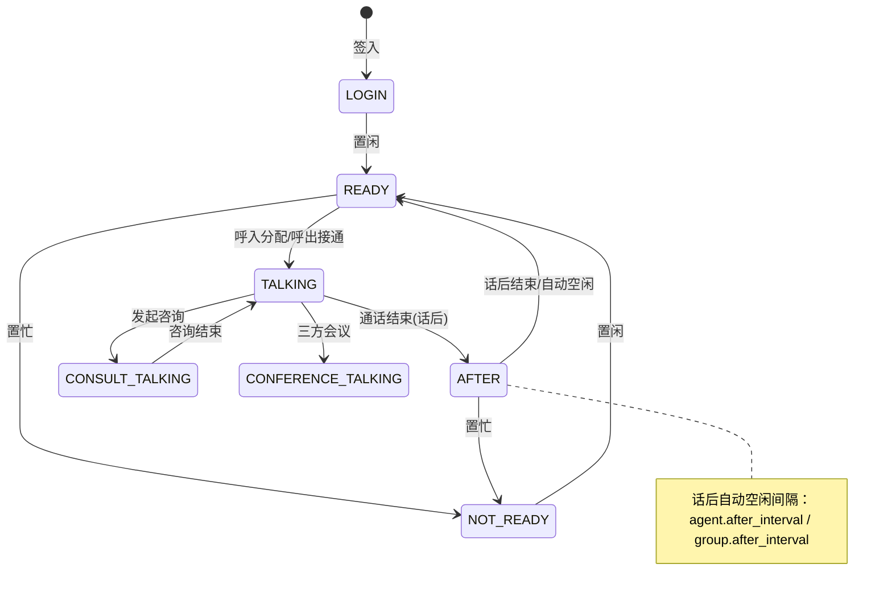
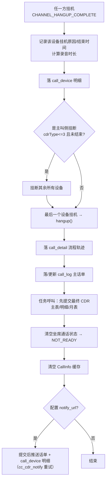
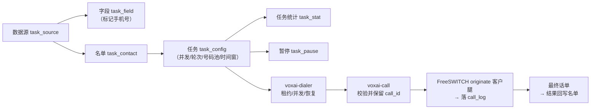

# 02 · 业务流程

> 流程图基于 `voxai-call` 模块实际代码梳理（`FsListen`、`Fs*Handler`、`cc.command.*`、`cc.acd.*`、
> `cc.websocket.handler.*`、`CallCdrService`）。图使用 Mermaid。

## 0. 总体架构与事件驱动模型

`FsListen` 连接 FreeSwitch（`cc_station` 中 `application_type=4` 的媒体服务），订阅全部 ESL 事件，
按事件名通过 `HandlerContext` 分发到 `@HandlerType` 标注的处理器。呼叫链路状态保存在 Redis（`CacheService`），
核心对象为 `CallInfo`（一次通话）与 `DeviceInfo`（通话中的一个「腿」/设备）。

```mermaid
flowchart LR
    subgraph 前端
        Web["坐席前端<br/>Vue3 + JsSIP"]
    end
    subgraph voxai-call
        WS["WebSocket<br/>Ws*Handler"]
        REST["REST /cti/call"]
        FS["FsListen<br/>ESL 事件"]
        ACD["GroupHandler<br/>ACD 队列"]
        CMD["cc.command.*<br/>VDN/转接/溢出"]
        CDR["CallCdrService<br/>话单/录音"]
    end
    subgraph 外部
        FreeSwitch["FreeSwitch<br/>媒体"]
        IVR["voxai-ivr :7300<br/>IVR 引擎"]
        MINIO["MinIO<br/>录音"]
        DB["DB / Redis"]
    end

    Web -- "cmd(JSON)" --> WS
    Web -- "HTTP" --> REST
    FreeSwitch -- "ESL event" --> FS
    FS --> CMD --> ACD --> FreeSwitch
    REST --> CDR
    WS --> CDR
    CDR --> DB
    FS --> CDR
    CMD -. "启动 IVR" .-> IVR
    CDR -. "上传录音" .-> MINIO
```

## 1. 呼入流程（Inbound）与 VDN 路由

客户拨打企业接入号码（后台称特服号），运营商先将电话送到 FreeSwitch。
`FsParkHandler.inboundCall` 按被叫号码匹配 `cc_vdn_phone`，确定企业并创建呼入 `CallInfo`；未匹配则记录失败话单并挂机。
FreeSwitch 应答后触发 `CHANNEL_ANSWER`，进入 `FsAnswerHandler.matchVdnCode`，定位 `vdn_id`，
校验企业有效后进入 `VdnHandler.hanlder` 按有效日程路由。
VDN 是呼入路由的中枢，下面分「主路由」「日程匹配」「按键导航」三块展开。

**呼入入口不调用字冠 → 网关组 → 媒体网关选路**。但 ACD 分配坐席后，`TransferAgentHandler` 主动呼叫坐席端时，
仍会按坐席号码选路；转外线时也会按转接号码选路。整通通话的呼入方向，与后续是否需要主动建立新呼叫腿是两个维度。

### 1.1 主路由（`VdnHandler.hanlder`）

```mermaid
flowchart TD
    A["CHANNEL_ANSWER<br/>FsAnswerHandler.matchVdnCode"] --> B["VdnHandler.hanlder<br/>取 VdnCode（先校验路由跳数）"]
    B --> B1{"callDetails ≥ 20<br/>（跳数上限 MAX_ROUTING_HOPS）?"}
    B1 -- 是 --> H[挂机]
    B1 -- 否 --> C{"VdnCode 存在<br/>且 status!=0?"}
    C -- 否 --> H[挂机]
    C -- 是 --> D["getEffectiveSchedule()<br/>按 levelValue 升序取首个生效日程"]
    D --> E{"有生效日程?"}
    E -- 否 --> H
    E -- 是 --> F{"route_type<br/>cc_vdn_config.route_type"}
    F -- "1 技能组" --> G1["getGroupInfo → GroupHandler.hander<br/>进入 ACD 流程"]
    F -- "2 放音" --> G2["getPlayback → 放音<br/>见 1.2 play_type 分支"]
    F -- "3 IVR" --> G3["transferIvrHandler.handler<br/>转 voxai-ivr"]
    F -- "4 坐席" --> G4["getAgentInfo 校验 READY<br/>transferAgentHandler.hanlder"]
    F -- "5 外呼" --> G5["transferCallHandler.hanlder<br/>转外线"]
    G1 --> TALK[通话]
    G4 --> TALK
    G5 --> TALK
    G3 --> TALK
    TALK --> CDR["挂机落单 call_log/call_detail/call_device<br/>录音 MinIO / 话单推送 notify_url"]
```

入口先校验路由跳数：`callInfo.getCallDetails().size() >= MAX_ROUTING_HOPS(20)` 即挂机，防止 VDN 间成环
（如放音后转路由字码自指/互指）导致无限循环。

### 1.2 日程匹配（`VdnSchedulePo.isEffectiveSchedule`）

`cc_vdn_config`（子码日程/路由项）通过 `schedule_id` 关联 `cc_vdn_schedule`（日程）。`VdnSchedulePo` 是二者的聚合
（`extends VdnConfig` + 内嵌 `scheduleConfig`），`getEffectiveSchedule()` 遍历已按 `levelValue` 升序排序的
`vdnSchedulePoList`，返回第一个满足全部条件的日程：

1. **星期**：`LocalDate.getDayOfWeek().getValue()`（1=周一 … 7=周日）对应 `mon..sun` 开关，命中天为 `0` 则不生效。
2. **日期范围**（`cc_vdn_schedule.type`）：
   - `type=1` 指定日期：`start_day`/`end_day` 为完整日期 `yyyy-MM-dd`，按 `isAfter`/`isBefore` 比较。
   - `type=2` 相对日期：`start_day`/`end_day` 为天号（1~31），按 `dayOfMonth` 比较。
3. **时间段**：`start_time`/`end_time`（`HH:mm:ss`）限定当天生效区间。

### 1.3 放音与按键导航（play_type）

`cc_vdn_config.play_type` 决定放音后的去向：

| `play_type` | 含义 | 处理 |
| --- | --- | --- |
| 1 | 按键导航 | 记 `dtmfNavigateId` 后 `receiveDtmf` 收键，走 1.4 |
| 2 / 3 / 4 / 5 | 技能组 / IVR / 路由字码 / 挂机 | 放音前把 `nextCommand` 入队并持久化，放音结束（`PLAYBACK_STOP`）后由 `FsPlaybackStopHandler` 执行 `doNextCommand` 转目标 |

放音类型 2/3/4/5 的链路：先在 `VdnHandler` 里构造 `NextCommand`（`NEXT_GROUP`/`NEXT_IVR`/`NEXT_VDN`/`NEXT_HANGUP`）
入队并 `addCallInfo` 持久化，再 `playback` 放音；放音结束触发 `PLAYBACK_STOP`，由 `FsPlaybackStopHandler`
取出队首 `nextCommand` 执行 `doNextCommand` 转目标。

### 1.4 按键导航收键（DTMF）

```mermaid
sequenceDiagram
    participant V as VdnHandler
    participant F as FreeSwitch
    participant E as FsExecuteComplateHandler

    V->>V: processData[dtmfNavigateId] = vdnSchedulePo.id<br/>（= cc_vdn_config.id）
    V->>F: receiveDtmf：play_and_get_digits<br/>min max retry end prompt … SYMWRD_DTMF_RETURN
    F-->>E: CHANNEL_EXECUTE_COMPLETE(application=play_and_get_digits)
    E->>V: matchDtmf(callInfo, deviceInfo, dtmf)
    alt 未匹配到 dtmf
        V->>F: 重新 receiveDtmf 播报
    else 匹配到
        V->>V: routeDtmf 按 cc_vdn_dtmf.route_type 分发
    end
```

`receiveDtmf` 下发 `play_and_get_digits`，收键参数取自 `cc_vdn_config` 的 `dtmf_min`/`dtmf_max`/`retry`/`dtmf_end`，
提示音 `prompt` 取 `cc_playback.playback`。收键完成后由 `FsExecuteComplateHandler` 捕获
`CHANNEL_EXECUTE_COMPLETE`，调用 `matchDtmf`：从 `CallInfo.processData` 取 `dtmfNavigateId`，
`findSchedule` 遍历 `getVdnCodeMap` 的 `vdnSchedulePoList` 按 `id` 定位当前 `VdnSchedulePo`，
再遍历其 `dtmfList`（`cc_vdn_dtmf`）精确匹配按键；未命中则重新 `receiveDtmf` 播报。命中后按 `cc_vdn_dtmf.route_type` 路由：

| `cc_vdn_dtmf.route_type` | 含义 | 处理 |
| --- | --- | --- |
| 1 | 技能组 | `getGroupInfo` → `GroupHandler.hander` |
| 2 | IVR | `transferIvrHandler.handler` |
| 3 | 路由字码 | `vdnHandler.hanlder`（递归进下一级 VDN） |
| 4 | 坐席分机 | `getAgentBySip(routeValue)` → 校验 READY → `transferAgentHandler.hanlder` |
| 5 | 挂机 | `hangupCall` |

`cc_vdn_dtmf` 按键分支由 voxai-admin 提供 CRUD 接口：`GET/POST /voxai-admin/config/vdn/config/{configId}/dtmf`、
`PUT/DELETE /voxai-admin/config/vdn/dtmf/{id}`，供前台配置按键导航分支。

### 1.5 三种路由枚举对照

VDN 链路里 `route_type` 出现三次、语义不同，务必区分：

| 字段 | 取值 |
| --- | --- |
| `cc_vdn_config.route_type` | 1技能组 / 2放音 / 3IVR / 4坐席 / 5外呼 |
| `cc_vdn_config.play_type` | 1按键导航 / 2技能组 / 3IVR / 4路由字码 / 5挂机 |
| `cc_vdn_dtmf.route_type` | 1技能组 / 2IVR / 3路由字码 / 4坐席分机 / 5挂机 |

## 2. 呼出流程（坐席外呼）

坐席通过 WebSocket 或 REST 发起外呼，由对应的 `WsMakeCallHandler` / `CallCdrService.makeCall` 创建 `CallInfo`。
平台先按坐席目标号码选择字冠、网关组和媒体网关，通过 `bgapi originate` 呼叫坐席；坐席应答后，
再按客户目标号码重新选路并呼叫客户，客户应答后桥接。两段呼叫可以使用不同的出口。

```mermaid
flowchart TD
    A["坐席发起外呼<br/>WS_MAKE_CALL / REST makeCall"] --> B["WsMakeCallHandler / CallCdrService.makeCall<br/>创建 CallInfo + device"]
    B --> C["按坐席目标号码选路<br/>字冠 → 网关组 → 媒体网关"]
    C --> D["originate 呼坐席分机/SIP/手机"]
    D --> E["坐席应答 CHANNEL_ANSWER<br/>NEXT_CALL_OTHER"]
    E --> E1["按客户目标号码重新选路<br/>字冠 → 网关组 → 媒体网关"]
    E1 --> F["originate 呼客户号码"]
    F --> G["客户应答 CHANNEL_ANSWER<br/>NEXT_CALL_BRIDGE"]
    G --> H["uuid_bridge 桥接坐席与客户"]
    H --> I[通话]
    I --> J[挂机 → 落单]
```

### 2.1 拨打短特服号码（以 10010 为例）

坐席拨打外部 `10010` 时，客户端这段呼叫仍按「`10010` → 字冠 → 网关组 → 媒体网关 → 线路商」执行，
不会因为号码较短而绕过选路，也不需要将它配置成平台的呼入 VDN 号码。

1. 配置支持该短号码的媒体网关，加入相应网关组。
2. 可配置字冠 `10010` 指向该组，或由合适的默认规则承接。若 `100` 已用于内部分机，应通过更具体的 `10010` 规则区分。
3. 按线路商要求检查被叫前缀；例如 `calledPrefix=9` 会实际发送 `910010`，不能默认所有线路都需要此处理。
4. 确认线路允许拨打该特服号码及其地区接续规则；普通手机号码可拨通不代表短特服号码一定可拨通。

当前选路使用严格前缀和号码长度匹配；网关组按配置使用轮询、权重或顺序主备，明确线路故障时可进入下一网关；
字段执行范围、默认规则次序及企业/全局字冠冲突详见 [业务范围 §3.6](01-业务范围.md#36-出局路由与网关)。

## 3. ACD 排队与分配流程

电话进入技能组后的核心流程，含指定坐席、记忆坐席、溢出策略、排队与定时分配。

```mermaid
flowchart TD
    A[进入技能组 GroupHandler] --> B[记录 CallDetail 技能组节点]
    B --> C{"指定坐席?<br/>DESIGNATE_AGENT"}
    C -- 是且空闲 --> C1[呼叫指定坐席]
    C -- 否 --> D{"记忆坐席?<br/>group_memory"}
    D -- 命中且空闲 --> D1[呼叫记忆坐席]
    D -- 未命中或不可用 --> E["取有效溢出策略<br/>getEffectiveOverflow"]
    E --> F{"处置类型<br/>handleType"}
    F -- "1 排队" --> G["加入队列 PriorityQueue<br/>按 busy_type 计算优先级"]
    G --> G1["播放排队音 queue.wav"]
    F -- "2 溢出" --> H["OverFlowHandler<br/>转 组/IVR/VDN"]
    F -- "3 挂机" --> H2[挂机]
    G1 --> LOOP["acd() 每秒扫描"]
    LOOP --> K{"队列超时?"}
    K -- 是 --> L["queueTimeout<br/>超时溢出 or 挂机"]
    K -- 否 --> M{"有空闲坐席?"}
    M -- 否 --> LOOP
    M -- 是 --> N["取空闲坐席<br/>按分配策略 AgentStrategy 优先级"]
    N --> O["呼叫坐席 transferAgentHandler"]
    O --> P["坐席应答 → 桥接 → 通话"]

    subgraph 队列与坐席池
      Q1["callInfoMap<br/>技能组→呼叫队列"]
      Q2["agentInfoMap<br/>技能组→空闲坐席"]
    end
```

### 3.1 分配策略（`cc.acd.assign` / `AgentStrategy`）

| 策略实现 | 含义（对应 `strategy_value`） |
| --- | --- |
| `LongReadyAssign` | 1 最长空闲时间 |
| `TotalReadyAssign` / `TotalReadyTimesAssign` | 2 最长平均空闲 |
| `LeastAnswerAssign` | 3 最少应答次数 |
| `LeastTalkAssign` | 4 最少通话时长 |
| `TotalAfterTimeAssign` | 5 最长话后时长 |
| `PollAssign` | 6 轮选 |
| `RandomAssign` | 7 随机 |
| `AgentCustomAssign` | 自定义（`customExpression` SpEL / `cc_group_strategy_exp`） |

### 3.2 排队策略（`cc.acd.lineup` / `LineupStrategy`）

| 策略实现 | 含义（对应 `busy_type`） |
| --- | --- |
| `DefaultLineupStrategy` | 1 先进先出 |
| `VipLineupStrategy` | 2 VIP 优先 |
| `CustomLineupStrategy` | 3 自定义表达式 |

### 3.3 策略配置与执行规则

策略数据分为三层，坐席分配策略与排队/溢出配置彼此独立：

| 配置 | 数据表 | 作用 |
| --- | --- | --- |
| 技能组坐席分配 | `cc_group_agent_strategy`；自定义权重见 `cc_group_strategy_exp` | 选择空闲坐席；按 `group_id` 关联技能组 |
| 技能组绑定排队/溢出策略 | `cc_group_overflow` | 通过 `group_id` + `overflow_id` 关联策略；`level_value` 决定查询顺序（当前按降序），`status=1` 才会加载 |
| 排队与溢出处置定义 | `cc_overflow_config` | `busy_type` 选排队算法；`handle_type` 选入队、立即溢出或挂机；排队超时时由 `busy_timeout_type` 决定溢出或挂机 |
| 溢出前置条件 / 自定义排队表达式 | `cc_overflow_front` / `cc_overflow_config.lineup_expression` / `cc_overflow_exp` | 前置条件按队列长度、最大等待时长或呼损率判断；表达式及权重字段虽有落库，但当前初始化没有把它们传入自定义排队计算 |

进入技能组时，系统先尝试指定坐席和记忆坐席；二者都未处理来电后，才匹配有效溢出策略。`handle_type=1` 时来电入队并按 `busy_type` 计算队列优先级，`handle_type=2` 立即转组/IVR/VDN，`handle_type=3` 挂机。排队超时后，`busy_timeout_type=1` 按 `overflow_type` 和 `overflow_value` 转出，`busy_timeout_type=2` 挂机。ACD 每 100ms 扫描一次队列，使用毫秒时间判断超时，超时处理通常在达到配置时长后的一个扫描周期内执行。

策略匹配和优先级有以下实现边界：

- 溢出绑定按 `cc_group_overflow.level_value` 降序读取；每条策略的前置条件是 **任一条件命中即有效**。没有前置条件的策略当前不会被判为有效。
- `getEffectiveOverflow` 按 `level_value` 降序检查绑定，当前策略条件不满足时会继续检查后续绑定，直到找到有效策略。
- 队列使用 `PriorityQueue` 堆顶取数，先按策略分值降序，再按入队时间升序；因此 FIFO、VIP 和自定义分值都会参与实际服务顺序。
- `busy_type=2` 的分值只使用 `VIP_LEVEL`，同一 VIP 等级内按入队时间先后服务，避免时间戳与 VIP 等级混用造成量纲问题。
- `busy_type=3` 使用 `lineup_expression` 作为 SpEL 自定义排队表达式；`cc_overflow_exp` 虽会被查询，但其权重项当前没有被合成为表达式。
- `cc_group_agent_strategy` 的分配策略作用于空闲坐席选择，不决定来电队列顺序；数据库 `strategy_value` 约定 6 为“轮选”，但当前 `PollAssign` 实现按服务时间排序，没有轮询游标。

## 4. 转接 / 咨询 / 会议 / 班长监控

```mermaid
flowchart TD
    subgraph 转接
      T1["坐席发起转接 WS_TRANSFER"] --> T2["呼目标坐席/外线/IVR"]
      T2 --> T3["目标应答 → 桥接目标与客户<br/>原坐席释放"]
    end
    subgraph 咨询
      C1["坐席发起咨询 WS_CONSULT"] --> C2["客户保持 hold.wav"]
      C2 --> C3["呼咨询对象（坐席/外线）"]
      C3 --> C4["桥接坐席与咨询对象"]
      C4 --> C5{"后续"}
      C5 -- "转接" --> C6["WS_CONSULT_TRANSFER 转给咨询对象"]
      C5 -- "取消" --> C7["WS_CONSULT_CANCEL 取回客户"]
    end
    subgraph 班长监控
      M1["班长发起 WS_LISTEN/WS_INSERT/WS_WHISPER"] --> M2["eavesdrop 接入目标通话"]
      M2 --> M3["监听(静默) / 强插(-b 三方) / 耳语(-w 单向)"]
    end
```

## 5. 坐席状态机

`AgentState` 枚举定义了坐席完整状态，`GroupHandler.agentFree/agentNotReady` 维护空闲坐席池。

```mermaid
stateDiagram-v2
    [*] --> LOGIN: 签入
    LOGIN --> READY: 置闲
    READY --> NOT_READY: 置忙
    NOT_READY --> READY: 置闲
    READY --> TALKING: 呼入分配/呼出接通
    TALKING --> AFTER: 通话结束(话后)
    AFTER --> READY: 话后结束/自动空闲
    AFTER --> NOT_READY: 置忙
    TALKING --> CONSULT_TALKING: 发起咨询
    TALKING --> CONFERENCE_TALKING: 三方会议
    CONSULT_TALKING --> TALKING: 咨询结束
    note right of AFTER
      话后自动空闲间隔：
      agent.after_interval / group.after_interval
    end note
```

## 6. 挂机与落单流程

```mermaid
flowchart TD
    A[任一方挂机<br/>CHANNEL_HANGUP_COMPLETE] --> B["记录该设备挂机原因/结束时间<br/>计算录音时长"]
    B --> C["落 call_device 明细"]
    C --> D{"是主叫侧挂断<br/>cdrType<=3 且未结束?"}
    D -- 是 --> E["挂断其余所有设备"]
    E --> F["最后一个设备挂机 → hangup()"]
    D -- 否 --> F
    F --> G["落 call_detail 流程轨迹"]
    G --> H["落/更新 call_log 主话单"]
    H --> I["任务呼叫：先提交最终 CDR<br/>主表/明细/月表"]
    I --> J["清空坐席通话状态 → NOT_READY"]
    J --> K["清空 CallInfo 缓存"]
    K --> L{"配置 notify_url?"}
    L -- 是 --> M["提交后推送话单 + call_device 明细<br/>（cc_cdr_notify 重试）"]
    L -- 否 --> N[结束]
```

## 7. 外呼任务流程（配置域）

完整业务说明见 [11-外呼任务](11-外呼任务.md) 和 [15-外部拨号引擎](15-外部拨号引擎.md)。
`voxai-dialer` 是仓库内独立部署的执行器，负责调度、租约恢复和结果回写；它不直接连接数据库或 FreeSWITCH。

任务域数据由 admin 管理，拨号执行器通过 HTTP API 领取名单并请求呼叫服务派发。这里给出业务数据流：

```mermaid
flowchart LR
    S["数据源 task_source"] --> F["字段 task_field<br/>（标记手机号）"]
    S --> CONTACT["名单 task_contact"]
    CONTACT --> T["任务 task_config<br/>（并发/轮次/号码池/时间窗）"]
    T --> STAT["任务统计 task_stat"]
    T --> P["暂停 task_pause"]
    T --> D["voxai-dialer<br/>租约/并发/恢复"]
    D --> CALLCTRL["voxai-call<br/>校验并保留 call_id"]
    CALLCTRL --> O["FreeSWITCH originate 客户腿<br/>→ 落 call_log"]
    O --> R["最终话单<br/>→ 结果回写名单"]
```

## 8. 坐席状态订阅（TCP，供第三方系统）

`TcpServer` 提供坐席状态订阅，`Sub*Handler` 处理订阅事件，用于第三方系统（CRM 等）实时获取坐席状态与通话事件。

| 订阅事件 | 说明 |
| --- | --- |
| `SubLogin` | 登录订阅 |
| `SubMakeCall` / `SubAnswer` | 呼叫/应答事件 |
| `SubStartCall` / `SubStopCall` | 通话开始/结束 |
| `SubPlayFile` / `SubQueuePlay` / `SubQueuePlayStop` | 放音事件 |
| `SubTransferTo` | 转接事件 |
