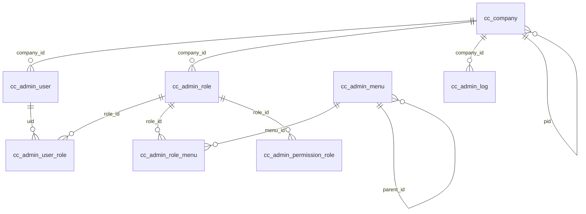
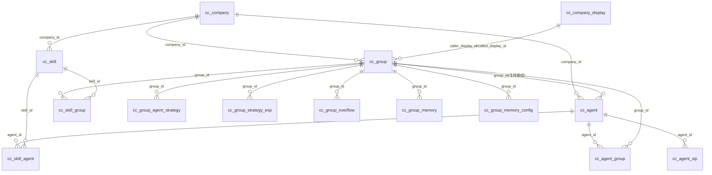
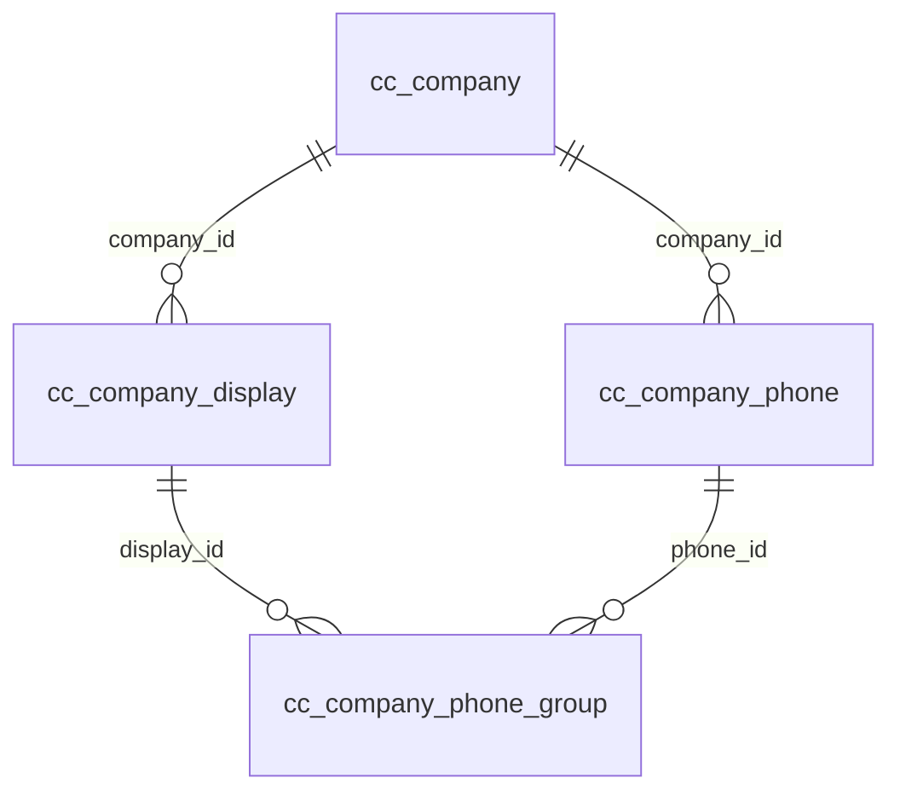
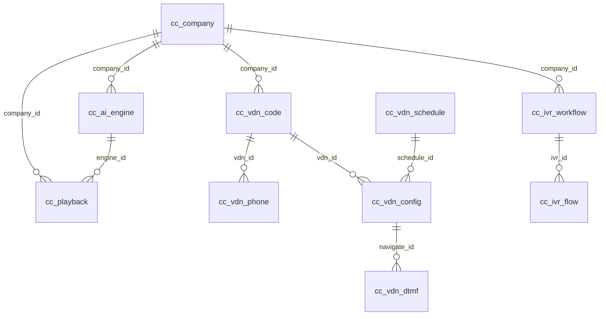
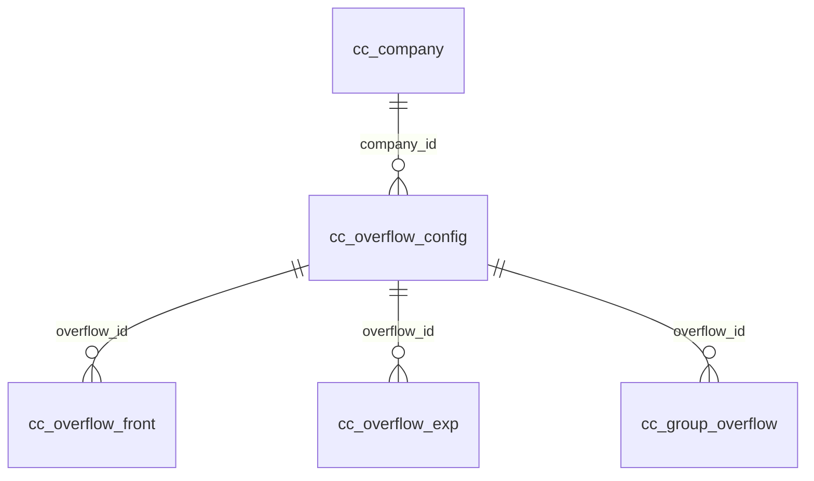
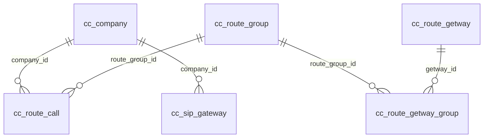
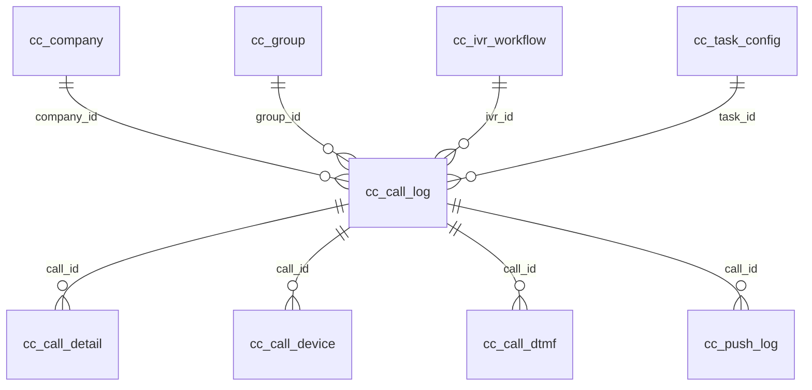
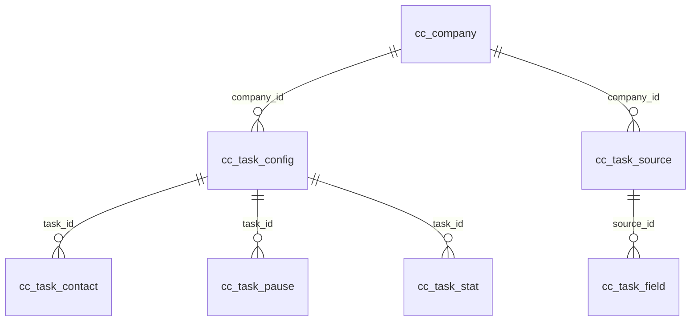

# 03 · 数据模型

> 数据表由 `voxai-common` 实体与 MyBatis Mapper 定义。表名统一 `cc_` 前缀（位置表 `location` 除外）。
> 关系列 `FK` 表示外键指向；本系统未在数据库层强制外键约束，以下关系为依据字段语义整理的逻辑关系。
>
> 共 **58 张落库表**（有 Mapper）；另有 4 个实体无对应 Mapper：`AdminPermission`、`AdminPermissionRole`、
> `CallSpeechText`（语音转写，可能由 ASR 服务维护）、`StreamEntity`（运行时对象）。

## 1. 领域关系总览

```mermaid
flowchart TD
    CO["cc_company 企业(租户)"]
    CO --> AU["cc_admin_user 账号"]
    CO --> AG["cc_agent 坐席"]
    CO --> GR["cc_group 技能组"]
    CO --> SK["cc_skill 技能"]
    CO --> VDN["cc_vdn_code 呼入路由"]
    CO --> IVR["cc_ivr_workflow IVR流程"]
    CO --> AI["cc_ai_engine AI引擎"]
    CO --> OVF["cc_overflow_config 溢出策略"]
    CO --> RT["cc_route_call 字冠路由"]
    CO --> TASK["cc_task_config 外呼任务"]
    CO --> CL["cc_call_log 话单"]
    CO --> NUM["cc_company_phone/display 号码"]

    AG --> AGG["cc_agent_group 坐席-组"]
    GR --> AGG
    AG --> AG_SK["cc_skill_agent 坐席-技能"]
    SK --> AG_SK
    GR --> GR_SK["cc_skill_group 组-技能"]
    SK --> GR_SK

    VDN --> VDP["cc_vdn_phone 特服号"]
    VDN --> VDC["cc_vdn_config 子码日程"]
    VDC --> VDD["cc_vdn_dtmf 按键导航"]
    VDC --> VDS["cc_vdn_schedule 日程"]

    GR --> GRO["cc_group_overflow 组-溢出"]
    OVF --> GRO
    OVF --> OVFE["cc_overflow_front/exp 条件/权重"]
    GR --> GAS["cc_group_agent_strategy 分配策略"]
    GR --> GM["cc_group_memory 记忆坐席"]

    CL --> CLD["cc_call_detail 轨迹"]
    CL --> CLV["cc_call_device 明细"]
    CL --> PL["cc_push_log 推送"]

    RT --> RTG["cc_route_group 网关组"]
    RTG --> RGG["cc_route_getway_group"]
    RGG --> RGW["cc_route_getway 媒体网关"]

    TASK --> TS["cc_task_source 数据源"]
    TS --> TF["cc_task_field 字段"]
    TASK --> TC["cc_task_contact 名单"]
    TASK --> TST["cc_task_stat 统计"]
```

## 2. 表关系（ER 图）

### 2.1 组织与权限

### 2.2 坐席、技能组与技能

### 2.3 号码与显号

### 2.4 VDN / IVR / AI / 放音

### 2.5 溢出策略

### 2.6 出局路由与网关

### 2.7 话单

### 2.8 外呼任务

## 3. 表结构目录

> 通用字段：`id`（主键）、`cts`（创建时间戳）、`uts`（修改时间戳）、`company_id`（企业/租户）。

### 3.1 组织与权限

| 表 | 说明 | 关键字段 |
| --- | --- | --- |
| `cc_company` | 企业信息表（租户根） | `name`, `pid`/`id_path`(父企业), `company_code`, `contact`, `phone`, `balance`, `bill_type`, `pay_type`, `hidden_customer`, `secret_type`, `secret_key`, `ivr_limit`, `agent_limit`, `agent_size`, `group_limit`, `outbound_limit`, `expire_time`, `group_agent_limit`, `record_storage`, `notify_url`, `display_number`, `record_file_type`, `record_encrypt`, `cdr_encrypt_push`, `status` |
| `cc_admin_user` | 管理员账号 | `username`, `passwd`, `user_type`, `avatar`, `nickname`, `phone`, `email`, `status` |
| `cc_admin_role` | 角色表 | `role_name`, `status` |
| `cc_admin_menu` | 菜单表 | `menu_id`, `parent_id`, `name`, `path_url`, `path_method`, `menu_level`, `menu_order`, `icon`, `child_num`, `status` |
| `cc_admin_permission` | 权限表（无 Mapper） | `permission_name`, `permission_url`, `parent_id`, `is_front`, `is_interface` |
| `cc_admin_user_role` | 账号角色表 | `uid`, `role_id` |
| `cc_admin_role_menu` | 角色菜单表 | `role_id`, `menu_id` |
| `cc_admin_permission_role` | 权限角色表（无 Mapper） | `role_id`, `permission_id` |
| `cc_admin_log` | 操作日志 | `account`, `op_time`, `request_url`, `duration`, `user_ip`, `region`, `isp`, `request_params`, `status` |

### 3.2 坐席与技能

| 表 | 说明 | 关键字段 |
| --- | --- | --- |
| `cc_agent` | 座席工号表 | `agent_id`(工号), `agent_key`(账户), `agent_name`, `agent_code`(分机), `agent_type`(1普通/2班长), `passwd`, `sip_phone`, `record`, `group_id`(主技能组), `agent_online`, `after_interval`, `display`, `ring_time`, `host`, `status` |
| `cc_agent_group` | 坐席技能组表 | `agent_id`, `agent_key`, `group_id`, `status` |
| `cc_agent_sip` | 坐席 SIP 表 | `sip`, `agent_id`, `sip_pwd`, `status` |
| `cc_agent_state_log` | 坐席状态历史表 | `group_id`, `agent_id`, `agent_key`, `call_id`, `login_type`, `work_type`, `before_state`, `state`, `state_time`, `duration`, `busy_desc` |
| `cc_group` | 技能组表 | `name`, `after_interval`, `caller_display_id`/`called_display_id`(显号池), `record_type`(0不录/1振铃录/2接通录), `level_value`(优先级), `tts_engine`, `play_content`, `evaluate`, `queue_play`, `transfer_play`, `call_time_out`, `group_type`, `notify_position`, `notify_rate`, `notify_content`, `call_memory`, `status` |
| `cc_skill` | 技能表 | `name`, `remark`, `status` |
| `cc_skill_agent` | 坐席技能表 | `skill_id`, `agent_id`, `rank_value`, `agent_key`, `status` |
| `cc_skill_group` | 技能组技能表 | `skill_id`, `skill_name`, `group_id`, `level_value`, `rank_type`(1全部/2等于/3>/4</5介于), `rank_value`, `match_type`(1低到高/2高到低), `share_value`(占用率), `status` |
| `cc_group_agent_strategy` | 技能组坐席分配策略 | `group_id`, `strategy_type`(1内置/2自定义), `strategy_value`(1-7 策略), `custom_expression` |
| `cc_group_strategy_exp` | 坐席自定义策略表 | `group_id`, `strategy_key`, `strategy_present`(百分比), `strategy_type` |
| `cc_group_overflow` | 技能组溢出策略绑定 | `group_id`, `overflow_id`, `level_value`(优先级) |
| `cc_group_memory` | 坐席与客户记忆表 | `agent_key`, `group_id`, `phone`(客户电话) |
| `cc_group_memory_config` | 记忆坐席配置 | `group_id`, `success_strategy`/`success_strategy_value`, `fail_strategy`/`fail_strategy_value`, `memory_day`, `inbound_cover`, `outbound_cover` |

### 3.3 号码与显号

| 表 | 说明 | 关键字段 |
| --- | --- | --- |
| `cc_company_phone` | 企业号码 | `phone`, `type`(1呼入/2主显/3被显), `status` |
| `cc_company_display` | 号码池表 | `name`, `type`(1呼入/2主显/3被显), `status` |
| `cc_company_phone_group` | 号码池-号码关联 | `display_id`, `phone_id` |
| `cc_phone_area` | 号码归属地表 | `num_prefix`, `operator`, `num_type`, `num_code`, `num_province`, `num_city` |
| `location`（实体 `PhoneLocation`） | SIP 位置/注册表 | `username`, `domain`, `contact`, `expires`, `callid`, `user_agent` |

### 3.4 VDN / IVR / AI / 放音

| 表 | 说明 | 关键字段 |
| --- | --- | --- |
| `cc_vdn_code` | 呼入路由表 | `name`, `status` |
| `cc_vdn_phone` | 路由号码表（特服号） | `vdn_id`, `phone`, `caller_prefix`/`called_prefix`/`called_suffix`(前后缀去除), `ringing` |
| `cc_vdn_config` | 路由字码表（子码日程） | `vdn_id`, `schedule_id`, `route_type`(1技能组/2放音/3IVR/4坐席/5外呼), `route_value`, `play_type`(1按键导航/2技能组/3IVR/4路由字码/5挂机), `play_value`, `dtmf_end`, `retry`, `dtmf_max`/`dtmf_min` |
| `cc_vdn_dtmf` | 按键导航表 | `navigate_id`, `dtmf`, `route_type`, `route_value` |
| `cc_vdn_schedule` | 日程表 | `name`, `level_value`, `type`(1指定/2相对), `start_day`/`end_day`, `start_time`/`end_time`, `mon..sun`, `work_type` |
| `cc_ivr_workflow` | IVR 流程表 | `name`, `oss_id`(流程文件), `create_user`, `verify_user`, `voice_item`, `init_params`, `content`, `type`(1转接/2咨询), `status`(1-5 发布状态) |
| `cc_ivr_flow` | IVR 轨迹表 | `call_id`, `ivr_id`, `node_id`, `node_type`, `node_name`, `key_press`, `start_time`, `end_time` |
| `cc_ai_engine` | AI 引擎表 | `name`, `mrcp_profile`, `ai_type`, `ai_product`, `voice`, `grammar`, `ai_params`, `tts_template`, `status` |
| `cc_playback` | 放音文件表 | `name`, `oss_id`, `type`(1上传/2合成), `engine_id`, `engine_name`, `tts_params`, `hash_code`, `speech_text`, `playback`, `status` |

### 3.5 溢出策略

| 表 | 说明 | 关键字段 |
| --- | --- | --- |
| `cc_overflow_config` | 溢出策略表 | `name`, `handle_type`(1排队/2溢出/3挂机), `busy_type`(1先进先出/2vip/3自定义), `queue_timeout`, `busy_timeout_type`(1溢出/2挂机), `overflow_type`(1组/2ivr/3vdn), `overflow_value`, `lineup_expression` |
| `cc_overflow_front` | 溢出前置条件 | `overflow_id`, `front_type`(1队列长度/2最大等待/3呼损率), `compare_condition`, `rank_value` |
| `cc_overflow_exp` | 自定义溢出权重 | `overflow_id`, `exp_key`, `rate`(权重) |

### 3.6 出局路由与网关

| 表 | 说明 | 关键字段 |
| --- | --- | --- |
| `cc_route_call` | 字冠路由表 | `route_group_id`, `route_num`(字冠), `num_max`/`num_min`, `caller_change`/`caller_change_num`, `called_change`/`called_change_num` |
| `cc_route_group` | 网关组 | `route_group` |
| `cc_route_getway` | 媒体网关表 | `name`, `media_host`, `media_port`, `caller_prefix`/`called_prefix`, `profile`(拨号计划), `sip_header1..3` |
| `cc_route_getway_group` | 路由字冠关联组表 | `getway_id`, `route_group_id` |
| `cc_sip_gateway` | 网关注册账号表 | `company_code`, `company_name`, `username`, `passwd`, `internal`/`external`, `register_addr`, `register_time`, `expire`, `status`(0删/1不在线/2在线) |
| `cc_station` | 站点类型配置信息 | `application_id`, `app_name`, `application_type`(1API/2FS/3IVR/4媒体), `application_group`, `application_host`, `application_port`, `username`, `pwd`, `status` |

### 3.7 话单、录音与推送

| 表 | 说明 | 关键字段 |
| --- | --- | --- |
| `cc_call_log` | 话单表 | `call_id`, `caller`/`called`/`caller_display`/`called_display`, `number_location`, `agent_key`, `agent_name`, `group_id`, `login_type`, `task_id`, `ivr_id`, `bot_id`, `call_time`/`answer_time`/`end_time`, `call_type`, `direction`, `answer_flag`, `wait_time`, `answer_count`, `hangup_dir`, `hangup_code`, `media_host`/`cti_host`/`client_host`, `record`/`record2`/`record3`, `record_type`, `record_time`, `talk_time`, `frist_queue_time`/`queue_start_time`/`queue_end_time`, `month_time`, `follow_data`, `uuid1`/`uuid2`, `ext1..3`, `status` |
| `cc_call_detail` | 通话流程表（轨迹） | `call_id`, `detail_index`, `transfer_type`(1vdn/2ivr/3技能组/4按键/5外线), `transfer_id`, `reason`(出队列原因), `start_time`/`end_time` |
| `cc_call_device` | 话单明细表 | `device_id`, `agent_key`, `agent_name`, `device_type`(1坐席/2客户/3外线), `cdr_type`(1呼入/2外呼/3内呼/4转接/5咨询/6监听/7强插/8耳语), `from_agent`, `caller`/`called`/`display`, `called_location`/`caller_location`, `call_time`/`ring_start_time`/`ring_end_time`/`answer_time`/`bridge_time`/`end_time`, `talk_time`, `record_start_time`/`record_time`, `sip_protocol`, `record`/`record2`/`record3`, `channel_name`, `hangup_cause`, `ring_cause`, `sip_status`, `month` |
| `cc_call_dtmf` | 呼叫按键表 | `dtmf_key`, `process_id`, `call_id`, `dtmf_time` |
| `cc_call_speech_text` | 语音转写（无 Mapper） | `device_id`, `device_type`, `speech_id`, `speech_text`, `asr_product`, `intention`, `quality_status` |
| `cc_push_log` | 话单推送记录表 | `call_id`, `cdr_notify_url`, `content`, `push_times`, `push_response`, `status`(1失败/2成功) |

### 3.8 外呼任务

| 表 | 说明 | 关键字段 |
| --- | --- | --- |
| `cc_task_config` | 外呼任务配置 | `name`, `call_start_time`/`call_end_time`, `close_time`, `transfer_type`/`transfer_name`, `total_count`/`completed_count`/`answered_count`, `status`, `display_number`, `call_rounds`/`current_round`, `data_source`, `dialed_count`, `cruise_type`(预测式/巡航式), `concurrency`, `number_pool_name`, `after_call_duration`, `call_timeout`, `status_notify`/`traffic_notify`, `list_total`, `pause_start_time`/`pause_end_time` |
| `cc_task_source` | 名单数据源 | `name`, `field_count`, `list_count`, `status` |
| `cc_task_field` | 数据源字段 | `source_id`, `name`, `is_phone`, `field_type` |
| `cc_task_contact` | 名单（客户） | `task_id`, `name`, `phone`, `current_round`, `uuid`, `call_time`/`answer_time`, `call_status`, `call_result`, `agent_code`, `bridge_time` |
| `cc_task_pause` | 任务暂停记录 | `task_id`, `pause_start_time`, `pause_end_time` |
| `cc_task_stat` | 任务统计 | `task_id`, `task_name`, `transfer_name`, `stats_time`, `list_total`, `dialed_count`, `answered_count`, `answer_rate`, `pending_count`, `in_call`, `queue_count`, `signed_in_agents`/`idle_agents`/`busy_agents`/`after_call_agents`, `abandoned_count` |

### 3.9 统计

| 表 | 说明 | 关键字段 |
| --- | --- | --- |
| `cc_company_stat` | 企业统计 | `type`, `stat_time`, `agent_total`/`agent_used`, `call_total`/`plan_total`, `outbound_total`/`outbound_answered`, `task_outbound`, `agent_outbound_answered`, `inbound_total`/`inbound_assigned`/`inbound_answered`, `ivr_calls`, `abandoned_cnt`, `recording_cnt`/`recording_size`, `call_duration`/`inbound_duration`/`outbound_duration`, `queue_cnt`/`queue_duration`, `login_cnt`/`login_duration`, `idle_cnt`/`idle_duration`, `busy_cnt`/`busy_duration`, `after_call_cnt`/`after_call_duration` |
| `cc_stat_day_agent` | 坐席日统计 | `agent_key`, `agent_name`, `stat_time`, `callout_cnt`/`callout_answer_cnt`, `callin_cnt`/`callin_answer_cnt`, `login_cnt`/`ready_cnt`/`not_ready_cnt`/`after_cnt`, `login_time`/`ready_time`/`not_ready_time`/`busy_time`/`after_time`, `talk_time`/`callin_talk_time`/`callout_talk_time` |
| `cc_stat_hour_agent` | 坐席小时统计 | 同 `cc_stat_day_agent` |

### 3.10 黑白名单

| 表 | 说明 | 关键字段 |
| --- | --- | --- |
| `cc_black_phone` | 黑名单 | `num_prefix`, `type`, `thrid_url`/`thrid_method`(第三方拦截), `request_body`/`response_body`, `call_direction`, `schedule_id`/`schedule_name`, `status` |

## 4. 关键关系说明（补充）

1. **技能组是路由核心**：`cc_group` 关联显号池（`caller/called_display_id` → `cc_company_display`）、
   分配策略（`cc_group_agent_strategy`）、溢出策略（`cc_group_overflow` → `cc_overflow_config`）、
   记忆坐席（`cc_group_memory`/`cc_group_memory_config`），并通过 `cc_agent_group` 挂坐席、`cc_skill_group` 挂技能。

2. **VDN 三级路由**：`cc_vdn_code`（路由码）→ `cc_vdn_phone`（特服号）与 `cc_vdn_config`（子码日程）→
   `cc_vdn_dtmf`（按键导航）/ `cc_vdn_schedule`（日程）。`cc_vdn_config.route_type` 决定最终去向（技能组/放音/IVR/坐席/外呼）。

3. **话单三层结构**：`cc_call_log`（一次通话，`call_id` 雪花 ID）→ `cc_call_detail`（流程节点轨迹）与
   `cc_call_device`（每个设备腿的明细与录音）。`cc_call_dtmf` 记录按键，`cc_push_log` 记录话单推送。

4. **外呼任务数据流**：`cc_task_source`（数据源）→ `cc_task_field`（字段）→ `cc_task_contact`（名单）→
   `cc_task_config`（任务）→ 通话后落 `cc_call_log`（`task_id` 关联）。`cc_task_stat` 为任务实时统计视图。

5. **多租户隔离**：除 `cc_phone_area`、`location`、`cc_route_getway`、`cc_route_group`、
   `cc_route_getway_group`、`cc_station` 等系统级表外，业务表均带 `company_id`。
