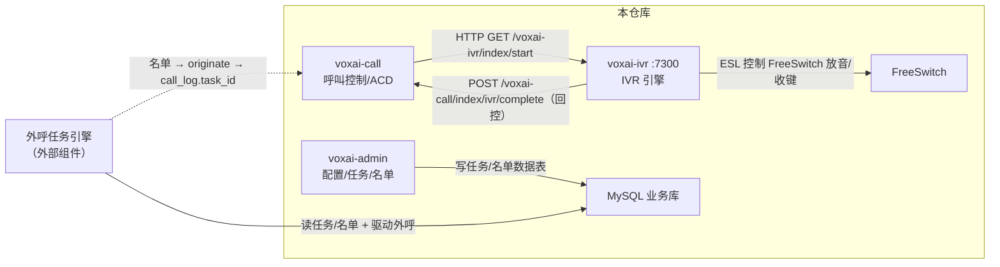

# 04 · 外部引擎接口约定（IVR / 外呼任务）

> 本文档梳理引擎与主系统之间的接口约定。其中 **IVR 引擎（voxai-ivr）已在本仓库实现**（见 `voxai-ivr` 模块）；
> **外呼任务引擎（预测式/巡航式拨号）仍为外部组件**。
>
> 约定等级标注：
> - ✅ **已实现** —— 代码中真实存在、可直接对接收口。
> - ⚠️ **推断** —— 由数据表字段/注释代码反推，需与引擎侧确认。
> - ❌ **未约定** —— 本仓库无任何实现或线索，属缺口。

## 1. 总体数据流



## 2. IVR 引擎接口约定（已在本仓库实现）

### 2.1 服务发现与部署

- IVR 引擎为独立 Spring Boot 模块 `voxai-ivr`，端口 7300、context-path `/voxai-ivr`，`@MapperScan("com.voxai.core.mapper")`。
- 复用 `voxai-common` 抽取的 ESL 客户端（`com.voxai.core.esl`）连接 FreeSwitch 媒体服务器（`cc_station` 中 `application_type=4`）。
- `voxai-call` 通过 `TransferIvrHandler` 以 HTTP 拉起（`http://voxai-ivr:7300`，硬编码服务名）。

### 2.2 启动 IVR 流程 ✅

| 项 | 约定 |
| --- | --- |
| 方法 / 路径 | `GET http://voxai-ivr:7300/voxai-ivr/index/start` |
| 请求参数（Query） | `callId`（Long，通话唯一标识）、`deviceId`（String，被转 IVR 的 FreeSwitch channel UUID）、`ivrId`（Long，`cc_ivr_workflow.id`）、`mediaHost`（String，`host:port`，用于定位 FreeSwitch 连接） |
| 响应 | `String`（调用方不解析返回值，仅判断异常） |
| 超时 | `httpClient` Bean（`cc.inner.connectTimeout=100ms`、`cc.inner.readTimeout=3000ms`） |
| 调用方 | `TransferIvrHandler`（呼入路由 `routeType=3`、溢出 `overflowType=2` 时触发） |

代码位置：`voxai-call/.../cc/command/TransferIvrHandler.java`、`voxai-ivr/.../controller/IvrController.java`

```java
httpClient.getForEntity(
  "http://voxai-ivr:7300/voxai-ivr/index/start?callId={callId}&deviceId={deviceId}&ivrId={ivrId}&mediaHost={mediaHost}",
  String.class, params);
```

### 2.3 IVR 流程数据契约 ✅

IVR 引擎消费的流程定义在 `cc_ivr_workflow`：

| 字段 | 语义 | 说明 |
| --- | --- | --- |
| `id` | 流程 ID | 即 `ivrId` |
| `name` | 流程名称 | |
| `oss_id` | 流程文件名 | 流程文件（语音流程定义）所在存储标识 |
| `content` | 流程内容 | IVR 流程 JSON 节点图（见 2.6），引擎解析执行 |
| `init_params` | 启动参数描述 | IVR 启动所需参数的描述 |
| `voice_item` | 语音文件 id 列表 | 逗号分隔，流程用到的语音 |
| `type` | 1 转接 / 2 咨询 | |
| `status` | 1-5 | 待发布/审核中/审核未通过/审核通过/已上线 |

运行时轨迹落 `cc_ivr_flow`（`call_id`、`ivr_id`、`node_id`、`node_type`、`node_name`、`key_press`、`start_time`/`end_time`）——由 `voxai-ivr` 的 `IvrFlowService` 写入（`IvrFlowMapper.insertSelective`）。

### 2.4 健康检查 ✅

`GET /voxai-ivr/index/health` 返回 `up`（`IvrController.health`）。

### 2.5 IVR 结束回控 ✅

IVR 只做语音交互（放音/收键/按键分支），到达转接节点时回调 `voxai-call` 继续路由：

| 项 | 约定 |
| --- | --- |
| 方法 / 路径 | `POST /voxai-call/index/ivr/complete` |
| 请求体（JSON） | `{ "callId": Long, "deviceId": String, "transferType": String, "transferValue": String }`（`IvrCompleteVo`） |
| transferType | `group`（进技能组 ACD）/ `vdn` / `agent` / `hangup`（默认） |
| 处理 | `voxai-call` 的 `IvrCallbackController` 从缓存取 `CallInfo`/`DeviceInfo`，按 `transferType` 分发到 `groupHandler.hander` / `vdnHandler.hanlder` / `transferAgentHandler.hanlder` / `fsListen.hangupCall` |

### 2.6 IVR 流程 JSON 格式（`cc_ivr_workflow.content`）

```json
{
  "startNode": "n1",
  "nodes": [
    { "id": "n1", "type": "play", "file": "welcome.wav", "next": "n2" },
    { "id": "n2", "type": "input", "file": "menu.wav", "maxDigits": 1, "timeout": 5,
      "branches": [ { "key": "1", "next": "n3" }, { "key": "2", "next": "n4" } ],
      "default": "n2" },
    { "id": "n3", "type": "transfer", "targetType": "group", "targetValue": "1001" },
    { "id": "n4", "type": "transfer", "targetType": "hangup", "targetValue": "" }
  ]
}
```

节点类型：
- `play`：放音 `file`，结束转 `next`。
- `input`：放音 `file` 并收键（`maxDigits` 最大键长、`timeout` 超时秒），`branches[].key` 命中转对应 `next`，超时/无效转 `default`。
- `transfer`（结束节点）：`targetType ∈ {group, vdn, agent, hangup}`，`targetValue` 为目标 id / agentKey / 空。

## 3. 外呼任务引擎接口约定

### 3.1 定位

外呼任务引擎（预测式/巡航式拨号）**不在本仓库实现**，与主系统通过 **MySQL 数据表 + 话单关联** 松耦合。
本仓库只提供任务的**配置与名单管理**（voxai-admin），引擎独立读取数据驱动外呼。

### 3.2 数据契约（任务表族）✅

引擎读取的核心表：

| 表 | 角色 | 关键字段 |
| --- | --- | --- |
| `cc_task_config` | 任务定义 | `name`、`call_start_time`/`call_end_time`（可呼时间窗）、`transfer_type`/`transfer_name`（转接目标：坐席/技能组/IVR）、`display_number`、`call_rounds`/`current_round`（轮次）、`cruise_type`（预测式/巡航式）、`concurrency`（并发）、`number_pool_name`（号码池）、`call_timeout`（外呼超时）、`after_call_duration`（话后时长）、`status` |
| `cc_task_source` | 名单数据源 | `name`、`field_count`、`list_count` |
| `cc_task_field` | 数据源字段 | `source_id`、`name`、`is_phone`（是否手机号）、`field_type` |
| `cc_task_contact` | 名单（客户） | `task_id`、`name`、`phone`、`current_round`、`uuid`、`call_time`/`answer_time`、`call_status`、`call_result`、`agent_code`、`bridge_time` |
| `cc_task_pause` | 暂停区间 | `task_id`、`pause_start_time`/`pause_end_time` |
| `cc_task_stat` | 任务实时统计 | `list_total`、`dialed_count`、`answered_count`、`answer_rate`、`pending_count`、`in_call`、`queue_count`、`signed_in_agents`/`idle_agents`/`busy_agents`、`abandoned_count` |

### 3.3 外呼结果回写 ✅（经话单关联）

引擎发起外呼后，通话状态由 `voxai-call` 通过 FreeSwitch 事件落 `cc_call_log`（`task_id` 关联任务）、
`cc_call_device`、`cc_call_detail`。引擎侧可凭 `cc_call_log.task_id` 回查每通结果。

`cc_task_contact.call_status/call_result/agent_code/bridge_time` 由引擎侧更新（本仓库不写名单通话结果）。

### 3.4 通知回调 ⚠️（推断）

`cc_task_config` 含两个通知字段，语义指向引擎→主系统的回调：

| 字段 | 推断语义 |
| --- | --- |
| `status_notify` | 任务状态变更通知地址（启动/暂停/完成/异常） |
| `traffic_notify` | 流量/并发通知地址（名单消耗、接通率等） |

**本仓库无接收端实现**，也无请求/响应格式定义，需与引擎侧确认回调协议。

### 3.5 与 IntelliCall-Pro 的关系

README 指出纯 AI 无人呼叫（无人优先）参照 `IntelliCall-Pro` 项目。外呼任务引擎的拨号/机器人能力
与该项目同源，任务表族为二者共享的数据契约。

## 4. 附录：本仓库已实现的对外接口（相关集成面）

与两个引擎并列，以下是**真实存在、已实现**的对外接口，供引擎/第三方对接时复用：

### 4.1 CTI REST API（voxai-call）✅

代码注释中带编号（`5.x` 坐席侧 / `6.x` 管理侧），说明存在对应的外部 API 规范：

| 编号 | 方法 | 路径 | 说明 |
| --- | --- | --- | --- |
| 5.1.1 | POST | `/index/login` | 坐席登录（`AgentLoginVo`，返回 `AgentInfo`） |
| 5.2.1 | POST | `/cti/call/makeCall` | 发起呼叫（`MakeCallVo`） |
| 5.2.2 | POST | `/cti/call/hangup` | 挂断 |
| — | POST | `/cti/call/hold` / `cancelHold` | 保持 / 取消保持 |
| — | POST | `/cti/call/readyMute` / `cancelMute` | 静音 / 取消静音 |
| 6.1.1 | GET | `/cti/admin/call?callId=` | 查看话单 |
| 6.1.2 | GET | `/cti/admin/calling?callId=` | 查看通话中详情 |
| 6.2.1 | GET | `/cti/admin/agent/{agentKey}` | 查询坐席状态 |
| 6.2.2 | GET | `/cti/admin/group/{groupId}/ready` | 技能组空闲坐席 |
| — | GET | `/index/getcall?callId=` | 话单查询（无租户） |
| — | GET | `/index/health` | 健康检查 |

`MakeCallVo` 关键字段：`callType`（必填，`CallType` 枚举）、`called`（必填）、`caller`/`callerDisplay`/`calledDisplay`（可选，缺省用坐席/技能组配置）、`followData`（随路数据）、`uuid1`/`uuid2`。

### 4.2 坐席事件 WebHook ✅

坐席登录时传入 `webHook`（`AgentLoginVo.webHook`）。当坐席无 WebSocket 长连时，状态/通话事件以
`application/json` POST 到该地址（`WebSocketHandler` 第 331 行）。载荷为坐席事件 JSON。

### 4.3 话单推送（CDR Notify）✅

企业配置 `cc_company.notify_url`。通话结束后 POST 话单 JSON：

- 载荷：`CallLogPo`（`cc_call_log` 全字段 + `callDeviceList` 明细 + `caller`/`called`）。
- 头：`Content-Type: application/json`。
- 失败记录 `cc_push_log`（`push_times` 重试次数、`push_response` 返回）。

### 4.4 MQ（RabbitMQ，内部/异步）✅

| Exchange | Routing Key | Queue | 用途 |
| --- | --- | --- | --- |
| `CALL-LOG-EXCHANGE`（topic） | `DEVICE` / `DETAIL` / `CALLLOG` | `CALL-DEVICE-QUEUE` / `CALL-DETAIL-QUEUE` / `CALL-LOG-QUEUE` | CDR 落库异步化（`call.cdr.pressure=1` 时启用） |
| `AGENT-STATE-EXCHANGE`（topic） | `STATE` / `LOG` | `AGENT-STATE-QUEUE-{instanceId}` / `AGENT-LOG-QUEUE` | 坐席状态/日志同步 |
| `CC-CONFIG-EXCHANGE`（topic） | `""` | `CC-CONFIG-QUEUE-{instanceId}` | 配置变更通知 |

### 4.5 TCP 坐席状态订阅 ✅

`TcpServer` 提供第三方系统坐席状态订阅（登录/呼叫/应答/转接/放音事件），详见 [02-业务流程 §8](02-业务流程.md#8-坐席状态订阅tcp供第三方系统)。

## 5. 待补接口清单（缺口总结）

| 缺口 | 现状 | 建议 |
| --- | --- | --- |
| 外呼任务引擎回调（`status_notify`/`traffic_notify`） | ⚠️ 仅字段，无接收端 | 定义回调协议 + 主系统接收端点 |
| `cc_task_contact` 名单结果回写 | ⚠️ 引擎侧写，无明确状态枚举 | 统一 `call_status`/`call_result` 取值 |
| 外呼任务引擎发起外呼方式 | ⚠️ 经 originate，未约定 | 明确是引擎直连 FS 还是复用 `voxai-call` 的 `/cti/call/makeCall` |

> IVR 引擎的「启动」「回控」「轨迹落库」已在 `voxai-ivr` 模块实现，不再列为缺口。
