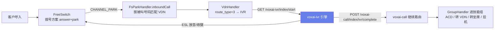

# 05 · IVR 引擎

> IVR（Interactive Voice Response，交互式语音应答 / 语音导航）：呼入电话进入后，通过「放音 + 收键 + 按键分支」
> 引导客户按键选择，最终转接到技能组 / 坐席 / VDN 或直接挂机。
>
> 本文档覆盖 `voxai-ivr` 引擎模块、流程定义（JSON）、数据模型、前端可视化编辑器与端到端联调。

## 1. 概述

- **后端引擎**：`voxai-ivr` 模块（Spring Boot，端口 7300，context-path `/voxai-ivr`）。
- **流程定义**：存于 `cc_ivr_workflow.content` 字段，JSON 节点图。
- **执行**：引擎通过 ESL（FreeSwitch）对通话通道放音、收键，按键分支，到达终节点后回控 `voxai-call` 继续路由。
- **轨迹**：每次经过的节点写入 `cc_ivr_flow`。
- **可视化编辑**：前端 `ai-call-center-web` 的 `IvrFlowEditor.vue`（基于 `@vue-flow/core`）拖拽编辑流程图。

## 2. 架构与调用链路



关键集成点：

| 位置 | 说明 |
| --- | --- |
| `FsParkHandler.inboundCall` | 呼入入口，按被叫号码匹配 `cc_vdn_phone`，创建 `CallInfo` 并下发 `NEXT_VDN` |
| `VdnHandler`（`route_type=3`） | 路由到 IVR，调用 `TransferIvrHandler` |
| `TransferIvrHandler` | HTTP 拉起 IVR：`GET /cc-ivr(实际 /voxai-ivr)/index/start?callId&deviceId&ivrId&mediaHost` |
| `IvrController` | IVR 引擎入口：`/index/start`、`/index/health` |
| `IvrCallbackController` | voxai-call 侧回控端点：`POST /voxai-call/index/ivr/complete` |

## 3. 流程定义（JSON 节点图）

### 3.1 节点类型

| 类型 | 含义 | 出边 | 关键字段 |
| --- | --- | --- | --- |
| `play` | 放音 | 1 条（`next`） | `file`（音频文件路径）、`next` |
| `input` | 收键（按键导航） | 多条（`branches`，每条一个按键） | `file`、`maxDigits`、`timeout`、`branches[].key/next`、`defaultNext` |
| `transfer` | 转接（终节点，无出边） | 0 条 | `targetType`、`targetValue` |

`transfer.targetType` 取值：`group`（技能组）、`vdn`（路由码）、`agent`（坐席）、`hangup`（挂机）。

### 3.2 JSON 结构

```json
{
  "startNode": "n1",
  "nodes": [
    { "id": "n1", "type": "play", "file": "welcome.wav", "next": "n2" },
    {
      "id": "n2", "type": "input", "file": "menu.wav", "maxDigits": 1, "timeout": 5,
      "branches": [
        { "key": "1", "next": "n3" },
        { "key": "2", "next": "n4" }
      ],
      "defaultNext": "n2"
    },
    { "id": "n3", "type": "transfer", "targetType": "group", "targetValue": "25" },
    { "id": "n4", "type": "transfer", "targetType": "hangup", "targetValue": "" }
  ]
}
```

- `startNode`：入口节点 id（无入边的节点）。
- `play.next`：放音结束后进入的节点 id。
- `input.branches`：按键 → 目标节点的映射；`defaultNext` 为超时 / 无效按键的去向。
- `transfer`：无出边，`targetValue` 为目标 id / agentKey（`hangup` 时为空）。

> 该结构同时是前端编辑器序列化输出与后端 `IvrFlowDef` / `IvrNode`（`com.voxai.ivr.flow.model`）的契约。

## 4. 后端引擎实现（voxai-ivr）

模块目录：`voxai-ivr/src/main/java/com/voxai/ivr/`

| 类 | 职责 |
| --- | --- |
| `CcIvrApplication` | 启动类，`@EnableDiscoveryClient` + `@MapperScan("com.voxai.core.mapper")`，`@LoadBalanced` RestTemplate 回控 |
| `controller/IvrController` | `GET /index/start`（入口）、`GET /index/health` |
| `flow/IvrFlowParser` | 解析 `content` JSON → 节点图 |
| `flow/IvrExecutor` | 执行器状态机：`play`→放音、`input`→收键分支、`transfer`→回控；内存 `Map<deviceId, IvrSession>` |
| `flow/model/IvrFlowDef` / `IvrNode` | 流程定义 POJO |
| `fs/IvrFsClient` | 复用 `com.voxai.core.esl`（抽取到 voxai-common），连接 FreeSwitch 媒体服务器，下发 `playback` / `play_and_get_digits` / `hangup` |
| `service/IvrFlowService` | 写 `cc_ivr_flow` 轨迹 |

**执行过程**：`/index/start` → 加载流程 → 解析 → 进入 `startNode` → 逐节点执行：

1. `play`：`playback <file>` → 等待 `CHANNEL_EXECUTE_COMPLETE` → 进入 `next`。
2. `input`：`play_and_get_digits`（返回变量 `SYMWRD_DTMF_RETURN`）→ 匹配 `branches[].key` → 进入对应节点；超时走 `defaultNext`。
3. `transfer`：写轨迹 → 回调 `POST /voxai-call/index/ivr/complete`。

**ESL 客户端复用**：FreeSwitch ESL 客户端已从 voxai-call 抽取到 `voxai-common`（`com.voxai.core.esl`），
voxai-call 与 voxai-ivr 共用（依赖 netty/guava/slf4j）。

## 5. 数据模型

| 表 | 说明 | 关键字段 |
| --- | --- | --- |
| `cc_ivr_workflow` | IVR 流程定义 | `name`、`content`（JSON 节点图）、`type`（1 转接/2 咨询）、`status`（1-5 发布状态）、`oss_id`、`voice_item`、`init_params` |
| `cc_ivr_flow` | 运行时轨迹 | `call_id`、`ivr_id`、`node_id`、`node_type`、`key_press`、`start_time`、`end_time` |
| `cc_vdn_code` / `cc_vdn_phone` | 呼入路由 / 特服号 | 被叫号码 → VDN |
| `cc_vdn_config` | 子码日程（路由项） | `route_type`（3=IVR）、`route_value`（= `cc_ivr_workflow.id`）、`schedule_id` |
| `cc_vdn_schedule` | 日程 | 星期开关、时间段 |
| `cc_playback` | 音频文件 | `name`、`playback`（文件路径，作为节点的 `file`） |

## 6. 前端可视化编辑器

前端项目 `ai-call-center-web`，依赖 `@vue-flow/core`。

| 文件 | 说明 |
| --- | --- |
| `src/components/IvrFlowEditor.vue` | 流程图编辑器：左节点面板（放音/收键/转接）拖拽、中画布连线、右属性面板 |
| `src/views/incoming/IvrManage.vue` | IVR 管理页：列表 CRUD + 抽屉内嵌编辑器 |

**能力**：
- 拖拽节点到画布、节点间拉线（箭头）、分支边带按键值标签。
- 放音/收键节点：从 `getPlaybackList` 真实加载音频文件。
- 转接节点：`group`/`vdn`/`agent` 目标分别从 `getGroupConfigList` / `getVdnList` / `getAgentConfigList` 加载。
- 序列化/反序列化与后端 JSON 契约一致（`getContent()` / `deserialize()`）。
- 保存走既有 `POST/PUT /ivr` 接口，`content` 存 JSON 字符串。

## 7. 端到端联调（已验证）

真实联调环境（FreeSwitch 8022 + MySQL voice9 + Nacos）下验证：

1. `loopback/9999` 呼入 → FreeSwitch 拨号方案 `9999.xml`（answer+park）。
2. `CHANNEL_PARK` → `FsParkHandler.inboundCall`（direction=inbound，按被叫 `9999` 匹配 VDN）。
3. VDN（`route_type=3`）→ `TransferIvrHandler` → `GET /voxai-ivr/index/start`。
4. voxai-ivr 加载流程 → `play`/`input` → `transfer` → 写 `cc_ivr_flow` 轨迹 → 回控 voxai-call。

已确认链路中每一步的日志与轨迹落库；回调曾因 RestTemplate 未 `@LoadBalanced` 返回 502，已修复（`@LoadBalanced`）。

## 8. 使用步骤

1. **准备音频**：在「语音文件」上传音频（`cc_playback`）。
2. **编辑流程**：前端「IVR管理」→ 新增 → 拖入 放音/收键/转接 节点 → 连线（input 出边填按键值）→ 选音频与转接目标 → 保存。
3. **配置呼入路由**：在「路由字码/VDN」把某个特服号的路由类型设为「IVR」，路由值选该流程；确保日程有效。
4. **触发呼入**：拨打该特服号，或 ESL `originate` 模拟，观察 `cc_ivr_flow` 轨迹与 `cc_call_log` 落单。
